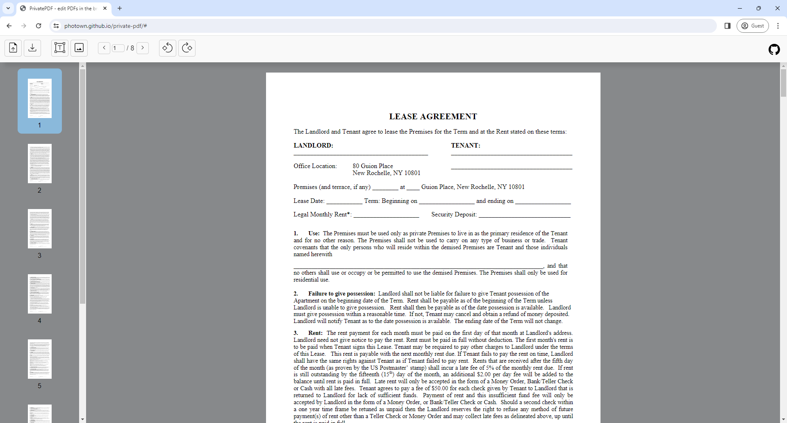
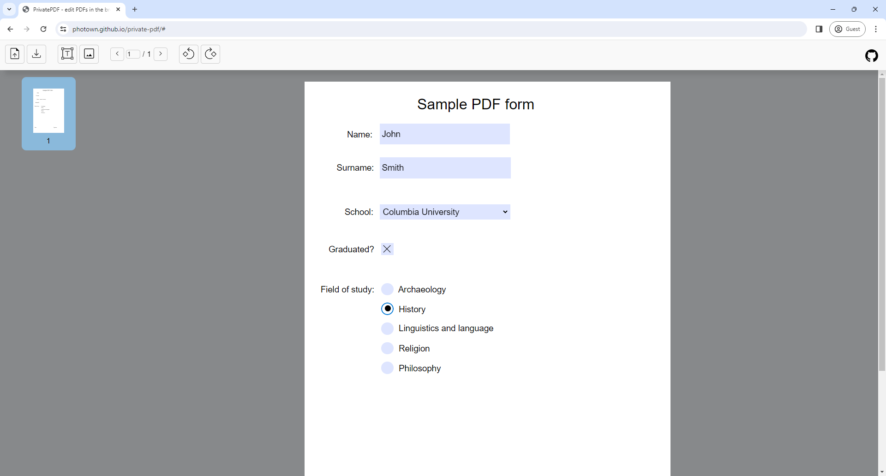
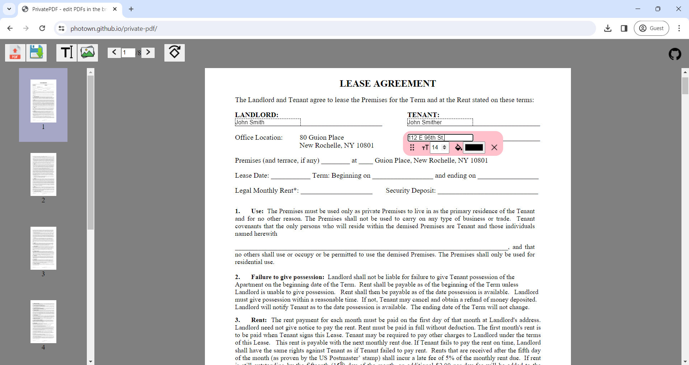
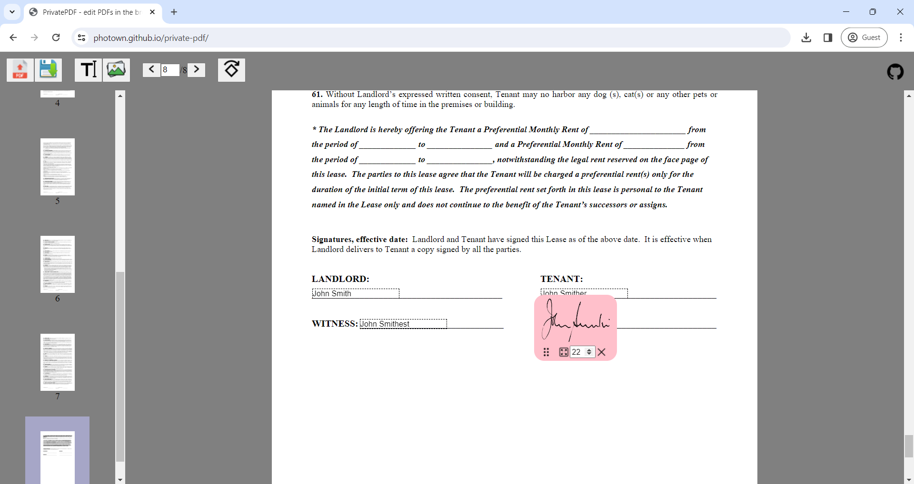
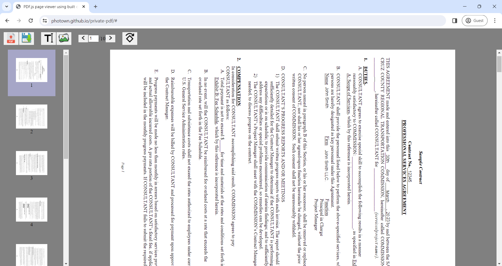

# PrivatePDF

PrivatePDF is a free web tool that lets users make quick PDF edits from within their web browser, without uploading anything anywhere.

I created this tool to make it quick and easy to sign PDF contracts, without having to deal with installing programs and without worrying that my PDFs will get uploaded somewhere.

It supports the bare minimum for my most common usecases. It is not intended to be a full-featured PDF editor.

[Check it out!](https://photown.github.io/private-pdf/)

This tool has mainly been tested on desktop Chrome on Windows 11.

## Features

### View PDFs

### Fill PDF forms

### Insert text

### Insert images

### Rotate PDFs

## Future features

- Create your own signature within the tool
- Ability to insert symbols
- Ability to rearrange and insert pages
- Load PDFs from link
- Improve UI

## Technologies used

- Written in TypeScript
- Bundled with Webpack
- PDFs rendered using [PDF.js](https://mozilla.github.io/pdf.js/)
- PDFs edited using [pdf-lib](https://github.com/Hopding/pdf-lib)
- Developed on Visual Studio Code
- Code formatted with [Prettier](https://prettier.io/)

## License

PrivatePDF is [MIT licensed](LICENSE).
